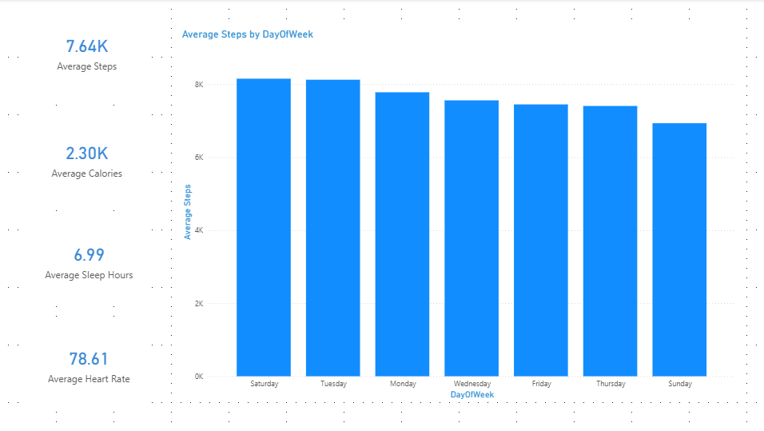
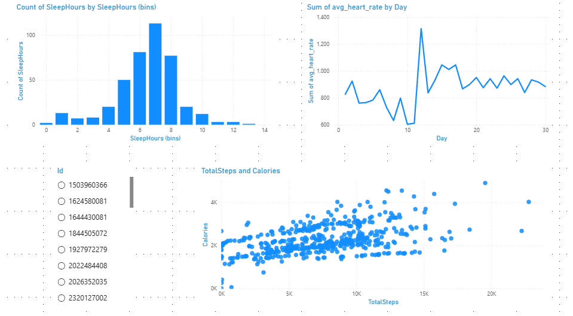

# Bellabeat Fitbit Data Analysis

This project analyzes fitness tracker data to identify activity, sleep, and health behavior patterns.
The objective is to explore user habits and extract insights that could help companies like **Bellabeat** improve their health products and user engagement strategies.

The analysis includes **data cleaning, exploratory data analysis (EDA), and dashboard development** to visualize key health and activity metrics.

---

# Business Context

Bellabeat is a high-tech company that manufactures health-focused smart products.
By analyzing fitness tracker data, the company can better understand user behavior and identify opportunities to improve engagement, product features, and personalized health insights.

This project explores Fitbit activity data to answer questions such as:

* How does physical activity relate to calories burned?
* What patterns exist in user sleep behavior?
* How does heart rate vary across users and activity levels?
* Are there noticeable weekly activity trends?

---

# Dataset

Dataset source:

https://www.kaggle.com/datasets/arashnic/fitbit

The dataset contains multiple CSV files with information collected from wearable devices, including:

* Daily activity metrics (steps, calories, activity minutes)
* Sleep tracking data
* Weight logs
* Heart rate measurements

Due to size limitations, the **raw dataset is not included in the repository**.

To reproduce the analysis, download the dataset from Kaggle and place the CSV files inside:

```
data/raw/
```

---

# Project Structure

```
Bellabeat-Case-study/

├── notebooks/
│   └── bellabeat_analysis.ipynb
│
├── data/
│   ├── raw/              # original dataset (ignored in git)
│   └── processed/        # cleaned datasets used for dashboards
│
├── images/               # exported visualizations and dashboard screenshots
│
├── dashboard/
│   └── bellabeat_dashboard.pbix
│
├── .gitignore
└── README.md
```

---

# Tools Used

* Python
* Pandas
* Jupyter Notebook
* Power BI
* Data cleaning and exploratory data analysis (EDA)

---

# Key Insights

### Physical Activity and Calories

A strong positive relationship exists between **daily steps and calories burned**, indicating that step count is a reliable indicator of overall physical activity.

### Weekly Activity Patterns

User activity levels remain relatively stable during weekdays, but **Sunday shows the lowest average number of steps**, suggesting reduced activity toward the end of the weekend.

### Sleep and Activity

The relationship between sleep duration and activity levels does not show a strong linear trend.
However, some clusters suggest that users with lower activity levels tend to report shorter sleep durations.

### Heart Rate Behavior

Heart rate data reveals clear differences between activity levels:

* **Active users** show a wider heart rate range, covering both resting and high activity BPM levels.
* **Sedentary users** remain within a narrower range and tend to have higher average heart rates.

### Weight Tracking

Weight data does not show a consistent trend due to irregular logging behavior across users, suggesting that weight tracking features may be underutilized.

---

# Dashboard

A **Power BI dashboard** was created to visualize key health and activity metrics.

Dashboard includes:

* Activity overview metrics
* Steps vs Calories analysis
* Sleep duration distribution
* Heart rate trends

Power BI file:

```
dashboard/bellabeat_dashboard.pbix
```

---

# Dashboard Preview

### Overview



### Activity Analysis



---

# How to Run the Project

1. Clone the repository

```
git clone https://github.com/user-name-c/Bellabeat-Case-study.git
```

2. Download the dataset from Kaggle

https://www.kaggle.com/datasets/arashnic/fitbit

3. Place the dataset files inside:

```
data/raw/
```

4. Open the notebook

```
notebooks/bellabeat_analysis.ipynb
```

5. Run the notebook to reproduce the analysis.

---

# Purpose

This project is part of a personal **Data Analyst portfolio** and demonstrates skills in:

* Data cleaning and preprocessing
* Exploratory data analysis
* Data visualization
* Business insight generation
* Dashboard development with Power BI
* Structuring analytical workflows using real-world datasets
